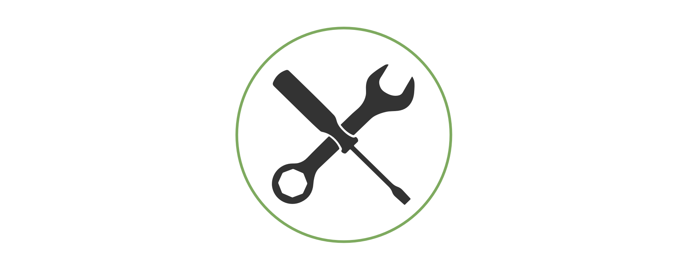

# Utilities

Utilities bundles several applications to manipulate event files.

# Installation

## Dependencies

Utilities relies on [Premake 4.x](https://github.com/premake/premake-4.x) (x ≥ 3), which is a utility to ease the install process. Follow these steps:
  - __Debian / Ubuntu__: Open a terminal and execute the command `sudo apt-get install premake4`.
  - __Fedora__: Open a terminal and execute the command `sudo dnf install premake`. Then, run<br />
  `echo '/usr/local/lib' | sudo tee /etc/ld.so.conf.d/neuromorphic-paris.conf > /dev/null`.
  - __OS X__: Open a terminal and execute the command `brew install premake`. If the command is not found, you need to install Homebrew first with the command<br />
  `ruby -e "$(curl -fsSL https://raw.githubusercontent.com/Homebrew/install/master/install)"`.

Utilities also depends on three home-made libraries Sepia, Tarsier and Pontella. They can be installed from source by executing the following commands from a terminal:
```sh
git clone https://github.com/neuromorphic-paris/sepia.git
cd sepia && premake4 install && cd .. && rm -rf sepia
git clone https://github.com/neuromorphic-paris/tarsier.git
cd tarsier && premake4 install && cd .. && rm -rf tarsier
git clone https://github.com/neuromorphic-paris/pontella.git
cd pontella && premake4 install && cd .. && rm -rf pontella
```

## Build

To build the applications, go to the *utilities* directory and run `premake4 gmake && cd build && make`.
The applications are compiled as command line executables in the *build/Release* folder.

# Documentation

## Rainmaker

Rainmaker generates a standalone html file with a 3D representation of events from an Event Stream file. The syntax is as follows:
```sh
./rainmaker [options] /path/to/input.es /path/to/output.html
```
Available options are:\n"
  - `-t [timestamp]`, `--timestamp [timestamp]` sets the initial timestamp for the point cloud (defaults to `0`)
  - `-d [duration]`, `--duration [duration]` sets the duration (in microseconds) for the point cloud (defaults to `1000000`)
  - `-e [decay]`, `--decay [decay]` sets the decay used by the maskIsolated handler (defaults to `10000`)
  - `-r [ratio]`, `--ratio [ratio]` sets the discard ratio for logarithmic tone mapping (default to `0.05`)
  - `-f [frame time]`, `--frametime [frame time]` sets the time between two frames (defaults to `auto`), `auto` calculates the time between two frames so that there is the same amount of raw data in events and frames, a duration in microseconds can be provided instead, `none` disables the frames
  - `-c`, `--change` displays change detections instead of exposure measurements, the ratio and frame time options are ignored
  - `-h`, `--help` shows the help message

## EsToCsv

EsToCsv converts an Event Stream file into a csv file (compatible with Excel and Matlab). The syntax is as follows:
```sh
./esToCsv [options] /path/to/input.es /path/to/output.csv
```
Available options are:
  - `-h`, `--help` shows the help message

## DatToEs

DatToEs converts a td file and an aps file into an Event Stream file. The syntax is as follows:
```sh
./datToEs [options] /path/to/input_td.dat /path/to/input_aps.dat /path/to/output.es
```
If the charcaters chain 'null' (without quotes) is given for the td / aps file, the Event Stream file is build from the aps / td file only.
Available options are:
  - `-h`, `--help` shows the help message

## ShiftTheParadigm

ShiftTheParadigm converts a set of png frames into an Event Stream file. The syntax is as follows:
```sh
./shiftTheParadigm [options] /path/to/frame\#\#\#\#\#.png /path/to/output.es
```
The sharps in the input filename are replaced by numbers (starting at 0), and can appear anywhere in the name. If there are several distinct sets of sharps in the filename (as an example, `/path/to/directory#/frame#####_####.png`), the last one is used (with the previous example, the first frame would be `/path/to/directory#/frame#####_0000.png`). The input frames must be 304 pixels wide and 240 pixels tall.
Available options are:
  - `-f [framerate], --framerate [framerate]` sets the input number of frames per second (defaults to `1000`)
  - `-c, --color` generates color events instead of ATIS events
  - `-t [threshold], --threshold [threshold]` sets the relative luminance threshold for triggering an event (defaults to `0.1`), when using the color switch, represents the minimum distance in L*a*b* space instead (defaults to `10)
  - `-b [black exposure time] --black [black exposure time]` sets the black exposure time in microseconds (defaults to `100000`), ignored when using the color switch
  - `-w [white exposure time], --white [white exposure time]` sets the white exposure time in microseconds (defaults to `1000`), ignored when using the color switch, the white exposure time must be smaller than the black exposure time
  - `-h`, `--help` shows the help message

# License

See the [LICENSE](LICENSE.md) file for license rights and limitations (MIT).
